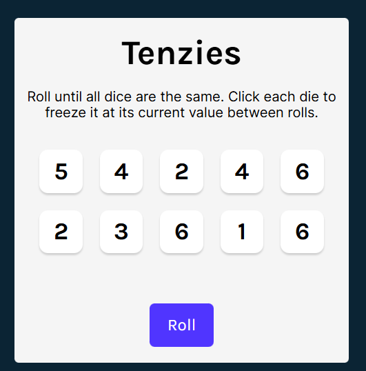

#  🎲 Tenzies Game

> A fun and interactive dice-rolling game where you try to get all dice to match. Test your luck and strategy!

---

## 🪞 Overview  
Tenzies is a simple yet addictive game built with React. The player rolls 10 dice and chooses which ones to “hold” in order to match all values. The game continues until all dice show the same number — then 🎉 Confetti appears to celebrate the win!
This project is perfect for beginners learning React state management, component props, and conditional rendering. 

---

## 🚀 Features  
✨ Key things your app can do:  

- 🎲 Roll 10 dice at once
- 📌 Hold individual dice to lock their value
- 🏆 Detects when the player wins (all dice equal + held)
- 🎉 Confetti animation on winning
- 🔁 Reset / Start New Game button
- ♿ Accessible with ARIA labels and screen-reader announcements

---

## 🧱 Tech Stack  
| Technology                  | Purpose                                 |
| --------------------------- | --------------------------------------- |
| **HTML5**                   | Structure of the app                    |
| **CSS3**                    | Styling and responsiveness              |
| **JavaScript (ES6)**        | Logic and interactivity                 |
| **React.js**                | Component-based UI and state management |
| **nanoid** | Unique ID generation                    |
| **react-confetti            | Win celebration animation               |

---

## 📚 What We Have Studied  

Here are the key JavaScript concepts or tools covered while building this project 🧩   

> Concepts practiced include:  
- React useState
- Updating arrays in state
- Conditional rendering
- Passing props and reusable components
- Accessibility with ARIA
- Integrating external libraries

---

## 🌿 Lessons Learned  
Reflect briefly on your takeaways:  

> Learned how to manage complex state

> improved understanding of component-based architecture

> Gained practice with accessibility features

> Strengthened React fundamentals

---

## 🖼️ Screenshots / Demo  

  

🔗 **Live Demo:**   

---

## 💫 Author  
👩‍💻 **Created by [Aliya](https://github.com/aliyasyeddd)**  
> _“Build. Break. Learn. Repeat.”_ 🌸  

---
